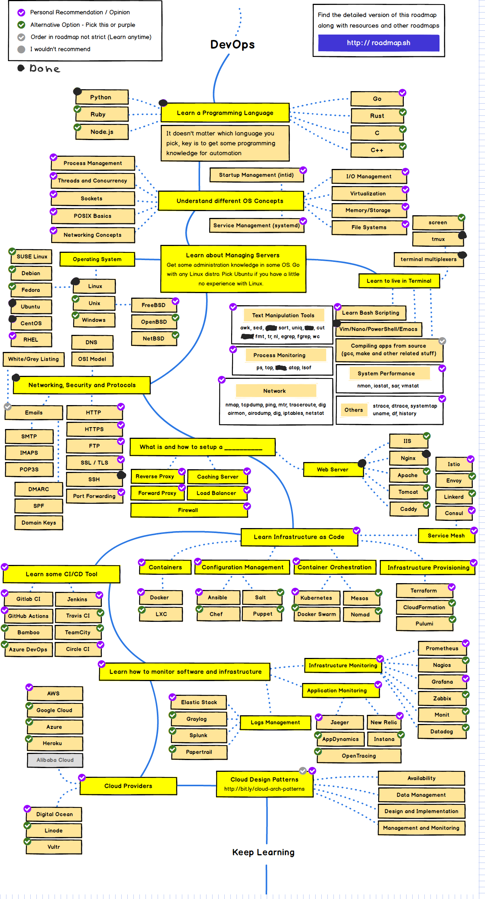

# DevOps
##### Planning -> Building -> Testing -> Deployment -> Monitoring
#### System Administration
- [x] en - https://www.youtube.com/watch?v=dmyiHoqyaWg
```
BASE
----
1. HOW COMPUTERS WORK (COMPONENTS)

2. OS
  ; Linux
    - Red Hat
    - SUSE
    - CentOS
    - Ubuntu/Debian
  ; MS
  ; Unix
    - FreeBSD

3. NETWORKING
  - Switch (between between Hub)
  - Routers / GateWay
  - ip4(6)
  - Ethernet
  - MAC addresses
  - DHCP
  - Ping
  - Traceroute
  - Firewalls

4. FOUNDATION SERVICES
  - DNS
  - Apache / Nginx
  - SMTP / IMAP - MX Record
  - Reverse DNS

5. VIRTUALIZATION
  - WmWare
  - Docker (Container)

6. SCRIPTING / PROGRAMMING
  - sh/bash
  - powershell
  - python3

7. CLOUD
  - AWS
  - GCP
  - Azure
```

#### DevOps
- [x] en https://www.youtube.com/watch?v=NrFz6_nULoc
```
FUNDAMENTALS
------------
1. OS
  - Linux
  - MS

2. NETWORKING
  - ip4(6)
  - routing
  - nat/pat
  - firewall
  - tcp
  - cidr
  - mask / netmask

3. REVISION CONTROL SYSTEMS
  - Git

4. SCRIPTING / PROGRAMMING
  - bash
  - powershell
  - python

INTERMEDIATE
------------
1. NETWORKING
  - Software Define Networking
  - Proxies
  - Load Balancing

2. SERVICES
  - DNS
  - HTTP(S)
  - SMTP

3. CONFIGURATION MANAGEMENT
  - Ansible
  - Terraform

4. VIRTUALIZATION
  - KVM
  ; Containers
    - Docker (Container)

5. STORAGE
  - NFS
  - Cloud Storage

7. Monitoring
  - Graphana
  - Nagious

8. Cloud providers
  - AWS

9. CI / CD MANAGEMENT TOOLS
  - Github Ci
  - Github Actions
  - Gitlab
  - Jenkins

10. DATABASES
  - Relational Database
  - NoSQL

11. ORCHESTRATION
  - docker swarm
  - Kubernetes

ADVANCED (Specialist)
--------
```

#### DevOps roadmap
- [x] https://roadmap.sh/devops

